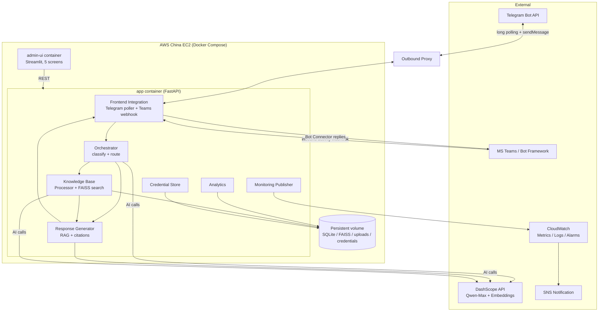
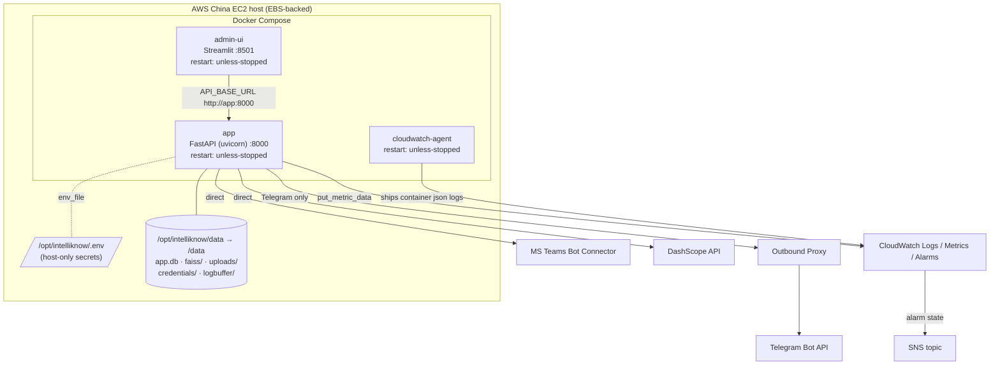
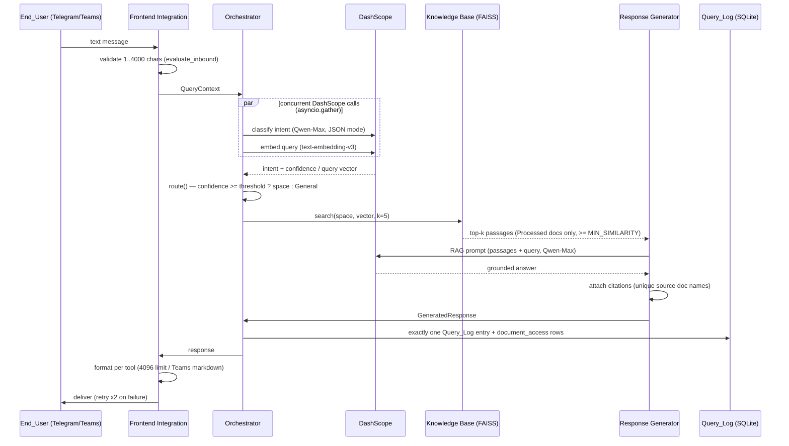

# IntelliKnow KMS — Architecture

## 1. Overview

IntelliKnow KMS is a Gen AI-powered Knowledge Management System delivered as a
production-ready MVP. End_Users ask questions from **Telegram** or **Microsoft
Teams** and receive cited, RAG-generated answers grounded in an
admin-managed document knowledge base. An **Admin** operates the whole system
from a **Streamlit** web UI.

The architecture is shaped by three hard constraints:

1. **MVP scope, 1-person workload** — a small set of lightweight, well-separated
   Python modules inside a single FastAPI application plus a separate Streamlit
   UI. No message brokers, no microservices, no Kubernetes.
2. **&lt;3s p95 end-to-end latency** — the query path is fully async, external AI
   calls run concurrently where possible, and every stage has an explicit
   latency budget.
3. **AWS China deployment reality** — Telegram is not directly reachable from
   AWS China, so all Telegram traffic goes through an **Outbound_Proxy**, and
   the Telegram integration uses **long polling** (outbound only) instead of
   webhooks to avoid needing an inbound endpoint reachable by Telegram.

### Technology Stack

| Concern | Choice |
|---|---|
| Backend API + bot integration | Python 3.11, FastAPI, httpx (async) |
| Admin UI | Streamlit (multi-page app) |
| Metadata + query log | SQLite (WAL mode) |
| Vector search | FAISS (`IndexIDMap2(IndexFlatIP)`, normalized vectors) |
| LLM (parsing, classification, RAG) | Aliyun Tongyi Qwen-Max via DashScope API |
| Embeddings | DashScope `text-embedding-v3` |
| Document extraction | pypdf / pdfplumber, python-docx, openpyxl, text/markdown |
| Deployment | Docker Compose on a single AWS China EC2 instance |
| Monitoring | CloudWatch metrics/logs/alarms + SNS |
| Testing | pytest, pytest-asyncio, Hypothesis, respx / unittest.mock |

## 2. System Components and Interactions

The backend is a single FastAPI process composed of importable modules with
clear seams. Each seam is injectable, which is what keeps the system testable
without touching the network.

| Component | Module(s) | Responsibility |
|---|---|---|
| Frontend Integration | `app/bots/*` | Telegram long-poller, Teams webhook, formatting, delivery retries, connectivity/status checks |
| Orchestrator | `app/core/orchestrator.py` | Concurrent classify + embed, threshold routing, retrieval, generation hand-off, Query_Log write |
| Knowledge Base | `app/kb/*` | Document ingestion pipeline, SQLite repositories, per-space FAISS search |
| Response Generator | `app/rag/generator.py` | RAG assembly, citations, no-match / failure handling |
| AI Client | `app/ai/*` | DashScope Qwen-Max chat + embeddings, timeouts, retries, prompt templates |
| Security | `app/security/credentials.py` | Fernet-encrypted Credential_Store, validation, masking |
| Analytics | `app/analytics/service.py` | Query_Log persistence, usage metrics, accuracy, CSV export |
| Monitoring | `app/monitoring/publisher.py` | CloudWatch metric publishing, local buffering |
| Admin REST API | `app/api/admin.py` | Endpoints consumed by the Streamlit UI |
| Admin UI | `admin_ui/*` | 5-screen Streamlit operator interface |

### System Context

### Key Interaction Notes

- **Telegram is outbound only.** A single asyncio task runs `getUpdates` long
  polling through the Outbound_Proxy; replies (`sendMessage`) go back through
  the same proxy. Only the Telegram httpx client is proxy-configured; DashScope
  and Teams traffic goes direct.
- **Teams is inbound webhook.** `POST /webhooks/teams` receives Bot Framework
  activities; replies go to the Bot Connector service URL from the activity.
  Microsoft's Bot Connector is reachable from AWS China.
- **Embeddings are the source of truth in SQLite; FAISS is derived.** Chunk
  embeddings persist as BLOBs; each Intent_Space FAISS index is rebuilt from
  SQLite on document delete or reassignment, which makes those operations
  trivially correct.
- **Classification and query embedding run concurrently** on the critical path
  (`asyncio.gather`), since the embedding does not depend on the classification
  result.
- **Observability never blocks the product path.** Query_Log writes, document
  access writes, and CloudWatch publishes are all best-effort — failures are
  logged and swallowed.

## 3. AWS China Deployment Model

The entire system runs via Docker Compose on a single AWS China EC2 instance.

### Deployment Topology

### Services (Docker Compose)

| Service | Runtime | Role | Ports | Restart |
|---|---|---|---|---|
| `app` | Python 3.11 + FastAPI (uvicorn) | Bot integration, orchestrator, KB, RAG, analytics, admin REST API, Telegram polling task, monitoring publisher | `8000` (Teams webhook + admin API) | `unless-stopped` |
| `admin-ui` | Streamlit | 5-screen Admin UI; calls `app` over the compose network (`API_BASE_URL=http://app:8000`) | `8501` | `unless-stopped` |
| `cloudwatch-agent` | `amazon/cloudwatch-agent` | Ships container stdout (JSON logs) + host metrics to CloudWatch Logs | — | `unless-stopped` |

### Persistence

Everything stateful lives under `/opt/intelliknow/data` on the EC2 host
(EBS-backed) and is bind-mounted into the `app` container at `/data`:

- `/data/app.db` — SQLite database (WAL mode)
- `/data/faiss/space_{id}.index` — one FAISS index file per Intent_Space
- `/data/uploads/` — original uploaded documents
- `/data/credentials/credentials.enc` — Fernet-encrypted credential store
- `/data/logbuffer/` — local retention when CloudWatch is unreachable

Because this is a host bind mount, the data survives container restart,
recreation, and image updates.

### Outbound Proxy for Telegram

Telegram is unreachable from AWS China. The `TELEGRAM_PROXY_URL` (sourced from
the host-only `/opt/intelliknow/.env`) configures an HTTPS forward proxy used
**only** by the Telegram httpx client. Long polling means the connection is
always initiated outbound from EC2, so a single proxy path handles both
receiving updates and sending replies. Proxy connectivity failures are retried
up to 3 times and logged (`TelegramAdapter._call_with_proxy_retries`).

### Boot and Restart Behavior

- The Docker daemon is enabled at boot (`systemctl enable docker`), and
  `restart: unless-stopped` on every service brings all containers up within
  5 minutes of an OS boot.
- A crashed container is restarted by dockerd within ~60 seconds.
- The `app` service has a healthcheck against `http://localhost:8000/health`.

### CloudWatch Monitoring and Alarms

- The in-process `CloudWatchPublisher` publishes `QueryLatencyMs`,
  `ErrorRatePercent`, and per-tool `IntegrationHealthy{tool}` at most every
  60 seconds via boto3 `put_metric_data`. On publish failure, datapoints are
  buffered to `/data/logbuffer/` and re-sent on the next successful cycle.
- The `cloudwatch-agent` container ships application stdout (structured JSON
  logs) to CloudWatch Logs within its ~60s flush interval.
- Alarms (provisioned by `deploy/setup_cloudwatch_alarms.py`): latency p95 over
  a threshold (default 3000ms) over 5 minutes; error rate over a threshold
  (default 5%) over 5 minutes; per-tool integration health unhealthy. Each
  alarm notifies an SNS topic.

Deployment artifacts: `docker-compose.yml`, `Dockerfile.app`,
`Dockerfile.admin-ui`, `deploy/ec2_bootstrap.sh`,
`deploy/cloudwatch-agent-config.json`, `deploy/setup_cloudwatch_alarms.py`, and
`deploy/DEPLOYMENT.md`.

## 4. End-to-End Query Flow and the &lt;3s Latency Budget

### 3-Second Latency Budget (p95)

| Stage | Budget | Notes |
|---|---|---|
| Message receipt → Orchestrator handoff | 100 ms | In-process async call |
| Intent classification (Qwen-Max) | 700 ms | Short JSON prompt, small `max_tokens` |
| Query embedding (DashScope) | *(concurrent)* | Runs in parallel with classification; off the critical path |
| FAISS search | 10 ms | Flat index, small corpus |
| RAG generation (Qwen-Max) | 1,600 ms | Passages capped at 5, bounded output |
| Formatting + delivery | 300 ms | Telegram send goes through the proxy |
| Buffer / logging overhead | 290 ms | Query_Log writes are best-effort |
| **Total** | **3,000 ms** | |

### Latency and Failure Guards

- Every external AI call has an explicit timeout: classification 5s, embedding
  5s, RAG 10s (`app/ai/dashscope_client.py`).
- Concurrency: classification and embedding are launched together with
  `asyncio.gather(return_exceptions-safe wrappers)`, so a failure in one does
  not cancel the other.
- Classification AI failure → route to General with confidence 0.
- Embedding failure → empty retrieval → no-match path (never a hard failure).
- The dispatch layer (`app/bots/dispatcher.py`) owns the overall deadline and
  delivery retries, so the End_User always receives an answer, a no-match
  message, or an honest could-not-process message.
