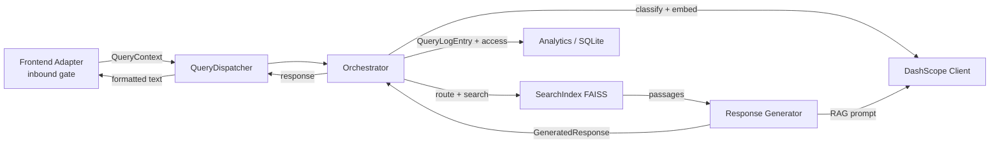
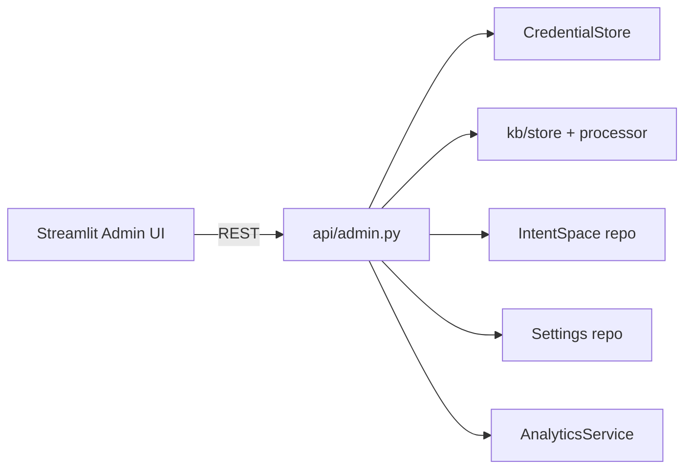
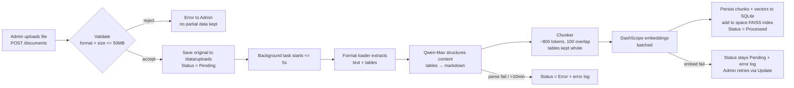
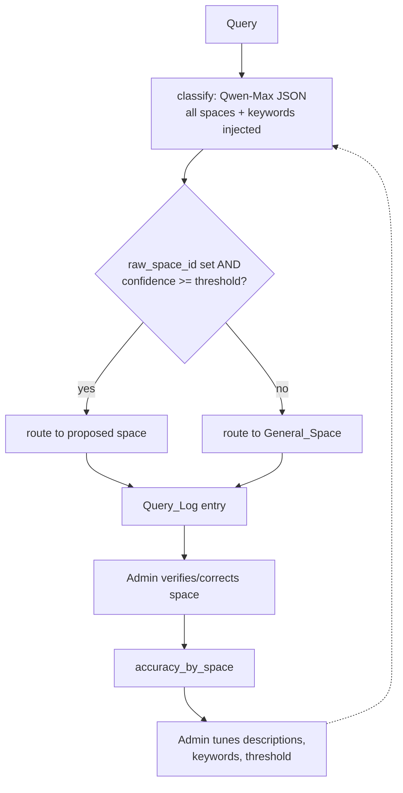

# IntelliKnow KMS — High-Level Design (HLD)

This document describes the responsibilities of each module and the data flow
between modules. It complements `ARCHITECTURE.md` (system context, deployment,
query flow) and `LLD.md` (interfaces, data models, signatures).

## 1. Module Map

```
app/
├── main.py                  # FastAPI assembly, startup/shutdown, background tasks
├── config.py                # Settings (env) + persistent-storage paths
├── db.py                    # SQLite schema bootstrap + first-startup seeding
├── bots/                    # Frontend Integration
│   ├── base.py              # FrontendAdapter protocol + inbound validation gate
│   ├── telegram.py          # Long-polling loop (via proxy) + sender + formatter
│   ├── teams.py             # Bot Framework webhook handler + sender + formatter
│   ├── dispatcher.py        # QueryDispatcher: deadline, delivery retries, error log
│   └── monitor.py           # Background integration status monitor
├── core/
│   ├── orchestrator.py      # classify → route → retrieve → generate → log
│   └── models.py            # Domain dataclasses
├── kb/                      # Knowledge Base
│   ├── loaders.py           # Per-format extraction (LangChain-loader pattern)
│   ├── processor.py         # parse → structure → chunk → embed → index
│   ├── store.py             # SQLite repositories
│   └── search.py            # Per-space FAISS index manager + rebuild
├── ai/
│   ├── dashscope_client.py  # Qwen-Max chat + embeddings, timeouts, retries
│   └── prompts.py           # Classification / structuring / RAG prompt templates
├── rag/
│   └── generator.py         # RAG assembly, citations, no-match / failure handling
├── security/
│   └── credentials.py       # CredentialStore (Fernet) + validation + masking
├── analytics/
│   └── service.py           # Query_Log writes, metrics, accuracy, CSV export
├── monitoring/
│   └── publisher.py         # CloudWatch metrics + local buffering
└── api/
    └── admin.py             # REST endpoints consumed by Streamlit
admin_ui/                    # Streamlit multi-page Admin UI (5 screens)
```

## 2. Module Responsibilities

### Frontend Integration (`app/bots/`)

Owns everything platform-specific about Telegram and Teams behind a common
`FrontendAdapter` protocol (`send`, `format`, `check_connectivity`).

- **Inbound validation gate** (`base.evaluate_inbound`): a pure function that
  forwards a message to the Orchestrator if and only if it carries text of
  1–4,000 characters; otherwise it returns a rejection message and nothing
  reaches the Orchestrator.
- **TelegramAdapter**: runs `getUpdates` long polling through the
  Outbound_Proxy, validates each update, and hands a `QueryContext` to the
  dispatcher. Formats a plain-text answer plus a `Sources:` footer, hard-capped
  at 4,096 characters with truncation applied to the body only so citations
  always survive. Retries sends and retries up to 3 times on proxy errors.
- **TeamsAdapter**: handles the inbound Bot Framework webhook and replies via
  the Bot Connector service URL, emitting Teams-friendly markdown.
- **QueryDispatcher**: owns the overall processing deadline, delivery retries
  (up to 2 additional attempts), and error logging to `integration_error_log`,
  with a swallow-and-continue guard so logging failures never break processing.
- **Status monitor**: periodically performs a lightweight per-tool API call and
  updates the stored Connected / Error / Disconnected status.

### Orchestrator (`app/core/orchestrator.py`)

The heart of the query path. For a `QueryContext` it:

1. Runs **intent classification** and **query embedding concurrently**.
2. Reads the **Confidence_Threshold from the settings table per query**, so an
   Admin update applies to every subsequent query immediately.
3. **Routes** via the pure `route()` function.
4. **Searches** the routed Intent_Space's FAISS index for the top-`k` passages
   (`k=5`).
5. **Generates** the grounded answer via the injected `ResponseGenerator`.
6. Writes **exactly one** Query_Log entry per query and a `document_access` row
   per document actually used.

### Knowledge Base (`app/kb/`)

- **loaders.py** — one deterministic extractor per format (PDF/DOCX/XLSX/TXT/MD)
  behind a common interface; returns `ExtractedContent` (body text + tables).
- **processor.py** — the ingestion pipeline (see §4).
- **store.py** — the single SQLite data-access layer: one repository per table
  group, each accepting an injectable connection.
- **search.py** — the per-space FAISS index manager: search, add-document, and
  atomic rebuild-from-SQLite.

### Response Generator (`app/rag/generator.py`)

Turns retrieved passages into a `GeneratedResponse` with one of three outcomes:
`no_match` (zero passages, no AI call), `success` (grounded answer + citations),
or `failed` (any AI/timeout failure on the generation path).

### Analytics (`app/analytics/service.py`)

Persists Query_Log entries (never raising), lists filtered history, computes
usage metrics (top documents, top spaces), computes per-space classification
accuracy over Admin-verified queries, and exports CSV.

### Monitoring (`app/monitoring/publisher.py`)

Publishes latency, error-rate, and per-tool integration-health metrics to
CloudWatch, buffering locally on failure and re-sending on the next cycle.

### AI Client (`app/ai/`)

The single seam to DashScope: `dashscope_client.py` speaks the OpenAI-compatible
dialect for chat (Qwen-Max) and embeddings with explicit per-call timeouts and
bounded retries; `prompts.py` is the single home for all prompt text.

### Security (`app/security/credentials.py`)

Fernet-encrypted credential storage with pure validation (runs before any
write) and masking that reveals at most the last four characters.

### Admin REST API + Admin UI (`app/api/admin.py`, `admin_ui/`)

The REST API exposes integration/KB/space/settings/analytics endpoints; the
Streamlit UI renders the five operator screens on top of it.

## 3. Data Flow Between Modules

### Query Path



Key data objects crossing module boundaries: `QueryContext` (adapter →
orchestrator), `Classification` (internal to orchestrator), `Passage[]`
(search → generator), `GeneratedResponse` (generator → adapter),
`QueryLogEntry` (orchestrator → analytics).

### Configuration / Admin Path



Admin actions (save credentials, upload/manage documents, manage Intent_Spaces,
set the Confidence_Threshold, view analytics/export) all flow UI → REST →
repositories/services, and every downstream query reads the resulting state.

## 4. Ingestion Pipeline



Design points:

- **Deterministic extraction, AI structuring.** Format loaders do the
  deterministic extraction; Qwen-Max then structures and normalizes the content
  and renders each extracted table as a GitHub-markdown table so row/column
  structure survives chunking. Tables are never split across chunks.
- **The parse/structure/chunk stage is bounded by a 10-minute (600s) deadline.**
  A parse failure, unsupported format, or deadline expiry sets Status `Error`
  and records an error-log entry.
- **Embed-only failure keeps Status `Pending`** so the Admin can retry via the
  Update action, rather than losing a successful parse.
- **Idempotent re-processing.** Update re-processing clears any prior chunks
  before writing new ones, so no stale rows survive.

## 5. Intent Classification and Routing Design

Classification and routing follow AI intent-classification best practices for a
maintainable, improvable classifier.

### Clear Intent Boundaries

The classifier is presented with **every Intent_Space** as a discrete block
(id, name, description, keywords) and is instructed to pick exactly one — "the
single best fit". The system prompt explicitly tells the model to keep the
domains distinct and choose the space whose description and keywords most
specifically match the question's topic. Each space's Admin-authored
description is the primary signal.

### Confidence Threshold + General Fallback

- The model returns a calibrated confidence on a 0–100 scale, with explicit
  calibration guidance (90–100 unmistakable, 70–89 clear, 40–69 plausible,
  &lt;40 guessing).
- The pure `route()` function assigns the model's proposed space **if and only
  if** the model proposed one and its confidence is at least the
  Confidence_Threshold; otherwise it routes to the **General_Space**.
- The threshold is Admin-configurable (default 70) and read per query, so
  changes take effect immediately.
- On any AI error/timeout, malformed JSON, or an unknown proposed space id, the
  classification is treated as a failure (proposed space `None`, confidence 0),
  which routes to General.

### Keyword-Guided Iteration

Admins define up to 50 keywords per Intent_Space to guide classification. Every
defined keyword for every space is injected into the classification prompt as a
hint (not a hard rule). This is the primary lever an Admin uses to iteratively
improve accuracy without code changes.

### Classification Logging for Accuracy Review

- Every query records exactly one Query_Log entry with the detected
  Intent_Space, the confidence score, the response status, and a timestamp.
- The Analytics screen lets the Admin verify/correct the detected space per
  query. `AnalyticsService.accuracy_by_space` then computes per-space accuracy
  as the percentage of that space's verified queries whose detected space
  matches the verified space (N/A when a space has no verified queries).
- This closes the improve-the-bot feedback loop: review logged classifications
  → verify/correct → adjust descriptions/keywords/threshold → measure accuracy.


